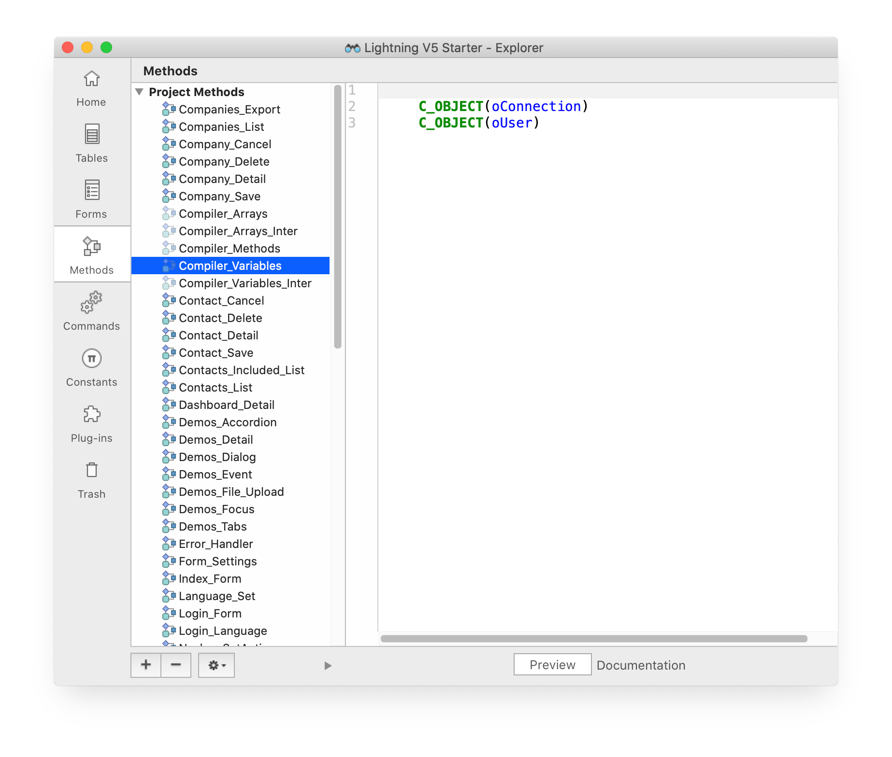
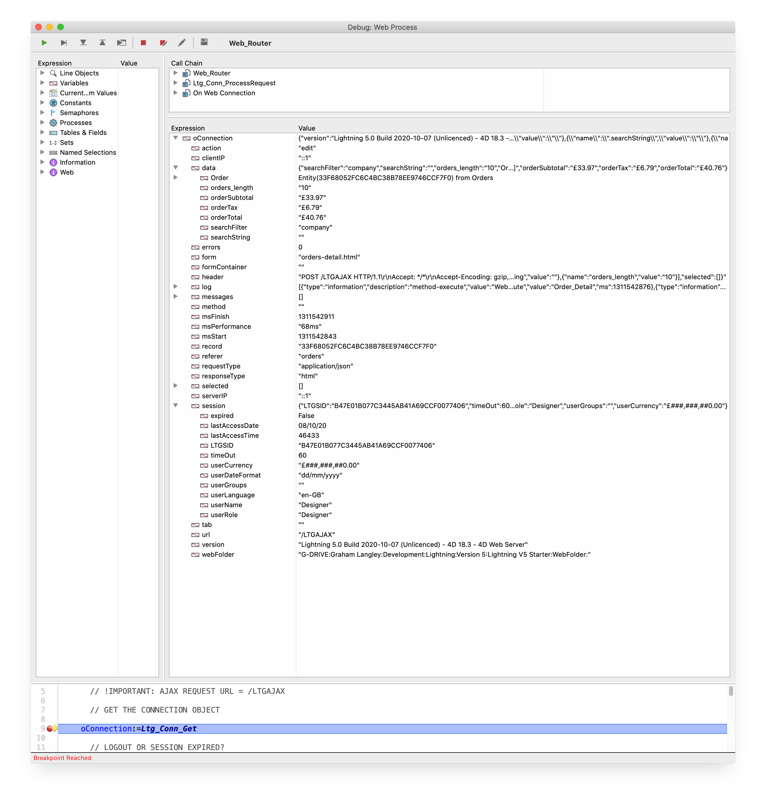

 <!--
    Connection :=Ltg_Conn_Get -> connection [object]
    
    Gets the Connection object.
 -->
 
# Ltg_Conn_Get

_Connection_ :=**Ltg_Conn_Get** -> connection [object]

## Description 

Gets the Connection object, containing all of the essential information for the current web connection request, including data.

The _data_ property is an object which contains the data for the current request, incoming and outgoing, and you will use this to
set and get values for your web application.

You can use 4D Object properties, and a "general" property similar to a 4D variable. There is no requirement for the (deprecated) _Compiler_Web_ method
for variable declarations/typing.

The Lightning V5 Starter demonstrates that there is no need to declare the _data_ property values in your application as _process variables_.

In the example screenshot below, taken from the demo, there are only two process variables for the entire application;



In this screenshot, there is an Order entity and general properties such as "searchFilter" in the _data_ object;



## Result

 Result        | Description                       | Type
------------   |-------------                      |-------------
*connection*   | Connection object                 | [object]

## Properties

 Property               | Category      | Description                           | Type
------------            |-------------  |-------------                          |-------------
*version*               | General       | Version information                   | [text]
*msStart*               | Performance   | Connection start (milliseconds)       | [longint]
*msFinish*              | Performance   | Connection finish (milliseconds)      | [longint]
*msPerformance*         | Performance   | Connection performance (milliseconds) | [text] 
*url*                   | HTTP          | URL                                   | [text]
*header*                | HTTP          | Header                                | [text] 
*clientIP*              | HTTP          | Client IP address                     | [text] 
*serverIP*              | HTTP          | Server IP address                     | [text] 
*referer*               | HTTP          | Referer                               | [text] 
*requestType*           | HTTP          | Request content type                  | [text] 
*responseType*          | HTTP          | Response content type                 | [text] 
*webFolder*             | Forms         | HTML root folder                      | [text] 
*formContainer*         | Forms         | Container form name                   | [text]
*form*                  | Forms         | Current form name                     | [text]
*action*                | Forms         | Action to process                     | [text]
*record*                | Forms         | Record selector                       | [text]
*method*                | Forms         | Method to execute                     | [text]
*tab*                   | Forms         | Active tab                            | [text]
*data*                  | Data          | Connection data                       | [object]
*selected*              | Data          | Selected data                         | [collection]
*log*                   | Log           | Execution log                         | [collection]
*errors*                | Log           | Execution errors                      | [longint]
*messages*              | Log           | Execution messages                    | [collection]
*session*               | Sessions      | Session                               | [object]

## Categories

### General

```4d
"version": "Lightning 5.0 Build 2020-09-17 (Licenced) - 4d 18.3 - 4d Web Server"
```

### Performance

```4d
"msStart": 1831441998,
"msFinish": 1831442040,
"msPerformance": "42ms"
```

### HTTP

```4d
"url": "/demos",
"header": "POST /LTGAJAX ...",
"referer": "demos",
"requestType": "application/json",
"responseType": "text/html"
```

### Forms

```4d
"formContainer": "",
"form": "contacts-detail.html",
"action": "edit",
"record": "30F12C50618047B5BC3F3CD40B4d3117",
"method": "",
"tab": "tabs-contacts-tab",
"webFolder": "Macintosh HD:Users:graham:Desktop:Lightning V5 Starter:WebFolder:"
```

### Data

```4d
"data": {
		"searchFilter": "name",
		"searchString": "putnam",
		"Company": {
			"Company_ID": "02A82F652A834C508A9F46D0F43092C4",
			"Company_Name": "Putnam Co Inc",
			"Address": "1 Milton St",
			"City": "Little Missenden",
			"County": "Buckinghamshire",
			"Postcode": "HP16 0DH"
		}
	}
```	

```4d
"selected": [
		{
			"form": "companies-list.html",
			"record": "289FB819B7CD49BD9D039457DFE97486"
		},
		{
			"form": "companies-list.html",
			"record": "F0E8E311C2954B30A6F129FAC0FFA5A2"
		},
		{
			"form": "companies-list.html",
			"record": "983C037715B0472F94A34E8189F7D8D1"
		}
	]
```	

### Log

```4d
"log": [
		{
			"type": "information",
			"description": "method-execute",
			"value": "Web_Router",
			"ms": 1832544633
		},
		{
			"type": "information",
			"description": "form-load",
			"value": "contacts-detail.html",
			"ms": 1832544634
		},
		{
			"type": "information",
			"description": "method-execute",
			"value": "Contact_Detail",
			"ms": 1832544649
		},
		{
			"type": "information",
			"description": "method-execute",
			"value": "User_Localise (en-GB) %contacts",
			"ms": 1832544650
		},
		{
			"type": "information",
			"description": "method-execute",
			"value": "User_Localise (en-GB) %company_name",
			"ms": 1832544650
		},
		{
			"type": "information",
			"description": "method-execute",
			"value": "User_Localise (en-GB) %first_name",
			"ms": 1832544651
		},
		{
			"type": "information",
			"description": "method-execute",
			"value": "User_Localise (en-GB) %last_name",
			"ms": 1832544651
		},
		{
			"type": "information",
			"description": "method-execute",
			"value": "User_Localise (en-GB) %job_title",
			"ms": 1832544652
		},
		{
			"type": "information",
			"description": "method-execute",
			"value": "User_Localise (en-GB) %phone",
			"ms": 1832544652
		},
		{
			"type": "information",
			"description": "method-execute",
			"value": "User_Localise (en-GB) %email",
			"ms": 1832544653
		},
		{
			"type": "information",
			"description": "method-execute",
			"value": "User_Localise (en-GB) %cancel",
			"ms": 1832544653
		},
		{
			"type": "information",
			"description": "method-execute",
			"value": "User_Localise (en-GB) %save",
			"ms": 1832544654
		}
	]
```	

```4d
"errors": 0
```

```4d
"messages": [
		{
			"form": "contacts-detail.html",
			"description": "method-execute",
			"value": "Web_Router",
			"line": 0,
			"type": "information"
		},
		{
			"form": "contacts-detail.html",
			"description": "form-load",
			"value": "contacts-detail.html",
			"line": 0,
			"type": "information"
		},
		{
			"form": "contacts-detail.html",
			"description": "method-execute",
			"value": "Contact_Detail",
			"line": 0,
			"type": "information"
		},
		{
			"form": "contacts-detail.html",
			"description": "method-execute",
			"value": "User_Localise (en-GB) %contacts",
			"line": 0,
			"type": "information"
		},
		{
			"form": "contacts-detail.html",
			"description": "method-execute",
			"value": "User_Localise (en-GB) %company_name",
			"line": 0,
			"type": "information"
		},
		{
			"form": "contacts-detail.html",
			"description": "method-execute",
			"value": "User_Localise (en-GB) %first_name",
			"line": 0,
			"type": "information"
		},
		{
			"form": "contacts-detail.html",
			"description": "method-execute",
			"value": "User_Localise (en-GB) %last_name",
			"line": 0,
			"type": "information"
		},
		{
			"form": "contacts-detail.html",
			"description": "method-execute",
			"value": "User_Localise (en-GB) %job_title",
			"line": 0,
			"type": "information"
		},
		{
			"form": "contacts-detail.html",
			"description": "method-execute",
			"value": "User_Localise (en-GB) %phone",
			"line": 0,
			"type": "information"
		},
		{
			"form": "contacts-detail.html",
			"description": "method-execute",
			"value": "User_Localise (en-GB) %email",
			"line": 0,
			"type": "information"
		},
		{
			"form": "contacts-detail.html",
			"description": "method-execute",
			"value": "User_Localise (en-GB) %cancel",
			"line": 0,
			"type": "information"
		},
		{
			"form": "contacts-detail.html",
			"description": "method-execute",
			"value": "User_Localise (en-GB) %save",
			"line": 0,
			"type": "information"
		}
	]
```	

### Sessions

```4d
"session": {
		"LTGSID": "EEDE7CDCF7014055B60AA24F5D707C6D",
		"timeOut": 30,
		"expired": false,
		"userName": "Designer",
		"userLanguage": "en-GB",
		"userDateFormat": "dd/mm/yyyy",
		"lastAccessDate": "2020-09-22",
		"lastAccessTime": 46757,
		"userRole": "Designer",
		"userGroups": "",
		"userCurrency": "£###,###,##0.00"
	}
```	

## Examples

```4d

    // Web_Router
    
    C_OBJECT(Connection)  // CONNECTION OBJECT (PROCESS VARIABLE)
    
    // GET THE CONNECTION OBJECT

    Connection:=Ltg_Conn_Get 
```
### Connection.data.property

#### HTML 

```4d
<input id=".searchString" name=".searchString" value="{{.searchString}}" />              
```

#### 4D

##### Setter

```4d
Connection.data.searchString :="abc@"
```

##### Getter

```4d
C_TEXT($txtValue)

$txtValue :=Connection.data.searchString
```

### Connection.data.object.property

#### HTML 

```4d
<input type="text" id="Company.City" name="Company.City" value="{{Company.City}}" />            
```

#### 4D

##### Setter

```4d
C_OBJECT($oCompany)

$oCompany :=ds.Companies.get($txtCompany_ID)

Connection.data.Company :=$oCompany
```

##### Getter

```4d
C_TEXT($txtValue)

$txtValue :=Connection.data.Company.City
```