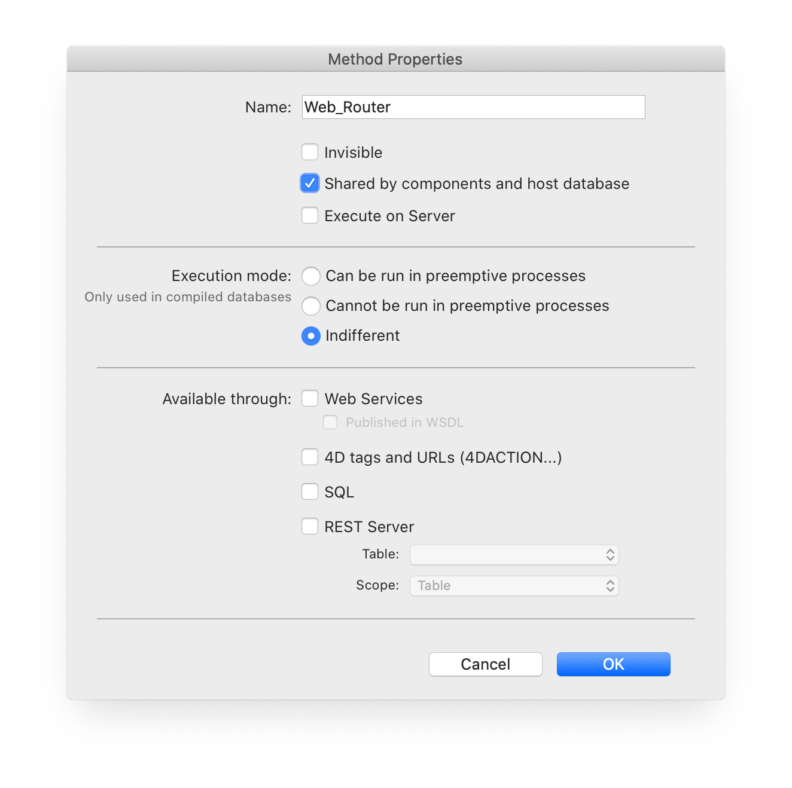

<!--
    Ltg_Method_Execute ( method/parameter [text] ) -> result [text]
        
    Executes a method with an optional parameter, includes error handling, information and error events added to the connection log. The method can return an optional text result if required.
-->
 
# Ltg_Method_Execute

*Ltg_Method_Execute* ( _method/parameter_ [text] ) -> result [text]

## Description

Executes a method with an optional parameter, includes error handling, information and error events added to the connection log. The method can return an optional text result if required.

*For each method in your host database requiring interaction with Lightning (a callback), the method property "Shared by components and host database" must be checked for correct operation.*



## Parameters

 Parameter          | Description                                                                            | Type
------------        |-------------                                                                           |-------------
*method/param*      | 4D Project Method name, you can pass an optional parameter using the forward slash "/" | [text]

## Result

 Result        | Description                       | Type
------------   |-------------                      |-------------
*result*        | Result text (optional)           | [text]

## Example

```4d
    C_TEXT($txtResult)
    
    $txtResult :=Ltg_Method_Execute ( "MyMethod/Param" )
```

## See also

**Ltg_Log**