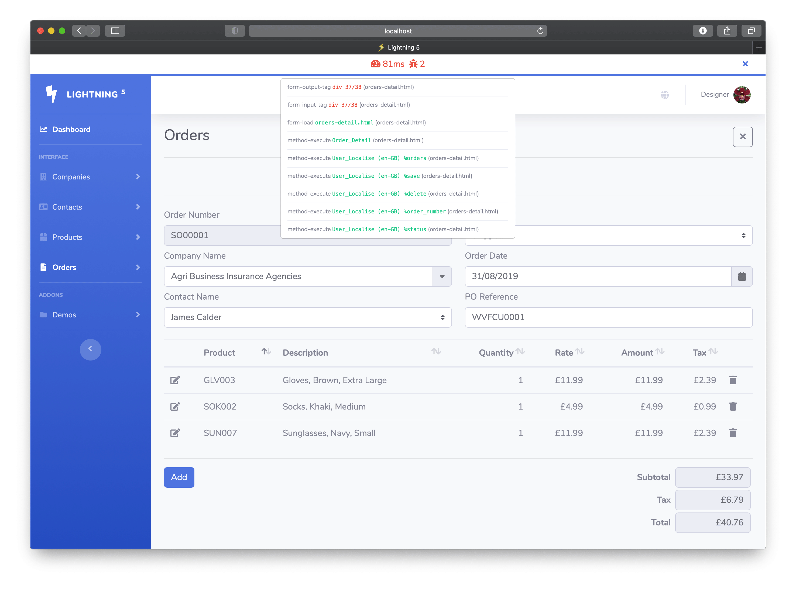

# Quality Control

For each connection, Lightning builds a log of events. The log can be used for quality control. 

You can view the Quality Control in the browser, if enabled using the HTML example below.



There are four levels of logging;

-	0 = OFF
-	1 = ON – Performance and error messages
-	2 = ON – Performance, information messages and error messages
-	3 = ON – Performance, information messages, error messages and html tag checking

Start with level 3, when there are no errors, move to level 1 to concentrate on tweaking for performance, for production, turn it OFF. 

## HTML

```4d
    <style>
        .popover {
        overflow:auto;
        max-height:298px;
        max-width:100%
        }
    </style>
  
    <!--QUALITY CONTROL-->
    <div class="bg-white border-bottom-primary" id="ltg-qc">
        <div class="container-fluid h-100">
            <div class="row align-items-center justify-content-between h-100">
                <div class="col-auto col-lg"></div>
                <div class="col col-auto d-xl-block justify-content-center">
                  <button type="button" class="btn btn-outline-success" data-toggle="popover" data-content="" data-placement="bottom" id="ltg-qc-popover" onclick="ltgQCPopover();" style="border:0px;border-radius:0px;min-width:220px;"><span id="ltg-performance"></span><span id="ltg-errors"></span></button>
                </div>
                <div class="col text-right">
                  <a href="#" class="btn btn-link btn-sm d-md-inline-block" onclick="ltgQCHide();">
                    <i class="fa fa-times"></i>
                  </a>
                </div>
            </div>
        </div>
    </div>
    <!--/QUALITY CONTROL-->
```
